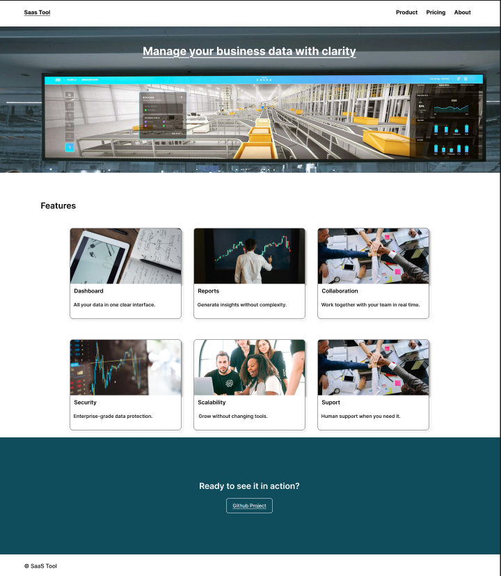
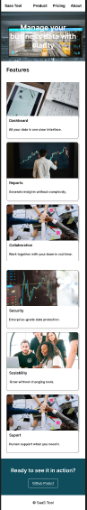

# Web Design Sample

desThis project demonstrates a CMS-friendly SaaS landing page designed in Figma and implemented using HTML and CSS.

## Goals
- Clear structure and hierarchy
- CMS-ready layout
- Responsive behavior
- Easy content updates for non-technical users

## Design
- Desktop-first (1440px)
- Mobile adaptation (375px)
- Simple color palette
- Max 2 font families
- Components designed for reuse

## Implementation
- HTML5
- CSS3
- Figma
- Git

https://www.figma.com/design/MN1lWfNDjcYrcfds4YvdDr/Odoo-Web-Portfolio?node-id=0-1&t=zhNr5WPcDwEDnVcf-1
